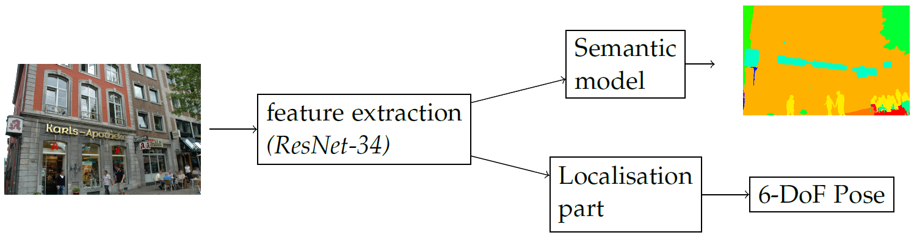

# Mapnet under challenging conditions
We evaluated NVIDIA's mapnet model under challenging conditions using the [AachenDayNight](https://www.visuallocalization.net/datasets/) dataset. We use the percentage formulation that is also used [here](https://www.visuallocalization.net/benchmark/).

Furthermore, we tested the influence of two augmentation techniques: 
 1. We augmented the dataset by artificial night images generated by a [CycleGAN](https://junyanz.github.io/CycleGAN/) network. 
 2. We forced the model to also learn a semantic segmentation of the input images as additional targets. The semantic segmentation was generated using [this](https://github.com/mapillary/inplace_abn) repository. 
 
 ||
 |:--:|
 |Concept of multitask model|

| Artificial night images | Semantic targets | Day-time results | Night-time results |
| --- | --- | --- | --- |
| no | no | 0 / 0 / 8.4 | 0 / 0 / 0 |
| yes | no | 0 / 0.1 / 16.1 | 0 / 0 / 4.1 |
| no | yes | 0 / 0.1 / 17.4 | 0 / 0 / 5.1 |
| yes | yes | 0 / 0 / 21.6 | 0 / 0 / 9.1 |


<details>
 <summary><b>Modifications to NVIDIA repository</b></summary><br/>
 
Modifications by Leonhard Feiner and Alexander Ziller: 
 - Support for DeepLoc dataset
 - Development of Dual-Input model (additional semantics as input to model)
 - Development of Multitask model (additional semantics as output to model)
 
Modifications by Alexander Ziller:
 - Support for AachenDayNight and Cambridge Landmarks dataset
 - Including augmentations for AachenDayNight dataset (using CycleGANs)
</details>


## Data
<details>
 <summary><b>Currently supported datasets</b></summary><br/>
 
 - [AachenDayNight](https://www.visuallocalization.net)
 - [DeepLoc](http://deeploc.cs.uni-freiburg.de/)
 - [CambridgeLandmarks](http://mi.eng.cam.ac.uk/projects/relocalisation/)
 - 7Scenes
</details>
<details>
 <summary><b>Additional data for Aachen Day Night</b></summary><br/>

 - [Artificial night images](https://syncandshare.lrz.de/dl/fiDymBjT43QSsJTqueiLo1S2)
 - [Semantic targets](https://syncandshare.lrz.de/dl/fiNcuDP7wmcGnS7Wgb8T2Y6c)

</details>
 
### Getting Started
<details>
 <summary><b>Setup</b></summary><br/>
 

Unlike the original implementation we use Python 3.

MapNet uses a Conda environment that makes it easy to install all dependencies.
1. Install [Anaconda](https://www.anaconda.com/download/)
2. Create the `mapnet` Conda environment: `conda env create -f environment_py3.yml`.
3. Activate the environment: `conda activate mapnet_release`.

</details>

<details>
 <summary><b> To use a dataset </b></summary><br/>
 
 1. Create in data/deepslam_data a directory with the corresponding name e.g. AachenDayNight
 2. Download data into this directory
 3. Go to scripts directory and run dataset_mean.py and calc_pose_stats.py (also good to verify data structure is correct)
</details>

## Running the code
<details>
<summary><b> Available models </b></summary><br/>

The following models are available
 - Posenet: Standard visuallocalization network by Alex Kendall
 - Mapnet: Base where this repository is forked from
 - Mapnet++: Mapnet with additional visual odometry and GPS data
 - Multitask: Mapnet with additional semantics as output (learning target)
 
</details>

<details>
<summary><b>  Training </b></summary><br/>

The executable script is `scripts/train.py`. See `python train.py -h` for options. 

Example usage: 
```
python train.py --dataset AachenDayNight --model mapnet --config configs/mapnet.ini --learn_beta --learn_gamma
```

If you have `visdom = yes` in the config file, you will need to start a Visdom
server for logging the training progress:

`python -m visdom.server -env_path=scripts/logs/`.

</details>

<details>
<summary><b>  Demo/Inference </b></summary><br/>

The inference script is `scripts/eval.py`. See `python eval.py -h` for options. Please store downloaded models in `scripts/logs`.and go to the `scripts` folder to run the commands.

Mapnet model weights trained on the Aachen Day Night dataset can be downloaded [here](https://syncandshare.lrz.de/dl/fiQq5w1QbvNt9LokHWKRQhpu)

</details>

<details>
<summary><b>  Visual Explanations of Model </b></summary><br/>

We included [code](https://github.com/1Konny/gradcam_plus_plus-pytorch) to calculate maps as described in the [GradCam++ paper](https://arxiv.org/pdf/1710.11063.pdf). 

Example usage:
```
python show_gradcampp.py --dataset DeepLoc --model multitask --val --n_activation_maps 3 --layer_name layer1,layer2 --config_file configs/uncertainty-criterion.ini --weights logs/DeepLoc__multitask_multitask-new-criterion_learn_beta_learn_gamma_learn_sigma_seed13/epoch_300.pth.tar
```

</details>


## Credits
This repository is a fork of [NVIDIA's mapnet repository](https://github.com/NVlabs/geomapnet). Look there for more background and additional information.

[Leonhard Feiner](https://github.com/LeonhardFeiner) contributed equally to include support for learning semantic labels until commit [7e5c754](https://github.com/a1302z/geomapnet/commit/7e5c754136a3cd2c04f1ad01b240908092e04636). 
### License

Copyright (C) 2018 NVIDIA Corporation.  All rights reserved.
Licensed under the CC BY-NC-SA 4.0 license (https://creativecommons.org/licenses/by-nc-sa/4.0/legalcode). 


## Documentation 

The original CVPR 2018 paper can be found at

[Samarth Brahmbhatt, Jinwei Gu, Kihwan Kim, James Hays, and Jan Kautz. Geometry-Aware Learning of Maps for Camera Localization. CVPR 2018.](https://arxiv.org/abs/1712.03342).

My master's thesis that discusses those results can be found [here](https://syncandshare.lrz.de/dl/fiQXZ8DuirBgMeM9iJJaKFQ3/?inline)

### Citation
Citation for original MapNet:

```
@inproceedings{mapnet2018,
  title={Geometry-Aware Learning of Maps for Camera Localization},
  author={Samarth Brahmbhatt and Jinwei Gu and Kihwan Kim and James Hays and Jan Kautz},
  booktitle={IEEE Conference on Computer Vision and Pattern Recognition (CVPR)},
  year={2018}
}
```
